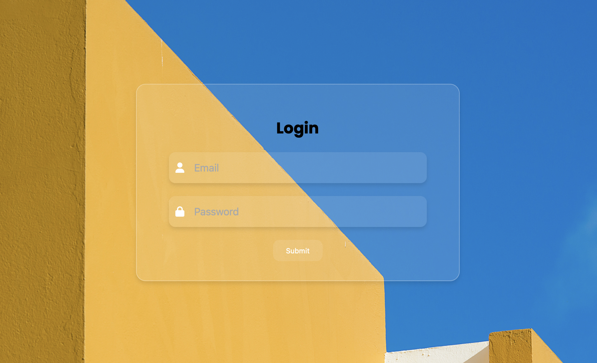

# Glassmorphism-Form

Le Glassmorphism est une tendance de design moderne qui met l'accent sur des éléments UI qui ressemblent à du verre translucide. Ce formulaire en est un exemple parfait, utilisant des éléments floutés, des transparences et un jeu de lumière pour offrir une expérience utilisateur rafraîchissante et élégante.

## Fonctionnalités

- Design élégant: Expérimentez le style moderne du glassmorphism avec des éléments floutés et des ombres douces.
- Responsive: Le formulaire est conçu pour être réactif et s'adaptera à toutes les tailles d'écran.
- Icônes intuitives: Grâce aux icônes de Font Awesome, le formulaire est intuitif et convivial.

## Comment l'utiliser ?

1. Clonage: Clonez ce dépôt dans votre machine locale.
2. Ouverture: Ouvrez le fichier index.html dans votre navigateur préféré.

## Personnalisation

- Changement de couleur: Pour changer les couleurs, modifiez les variables CSS dans le fichier styles.css.
- Ajout de champs: Si vous souhaitez ajouter plus de champs au formulaire, assurez-vous de suivre la structure existante pour conserver le style glassmorphism.
- Arrière-plan: Vous pouvez changer l'image d'arrière-plan en modifiant l'URL dans la règle CSS body du fichier styles.css.

## Contribution

Si vous avez des suggestions ou des améliorations, n'hésitez pas à ouvrir une issue ou à soumettre une pull request. Toutes les contributions sont les bienvenues!